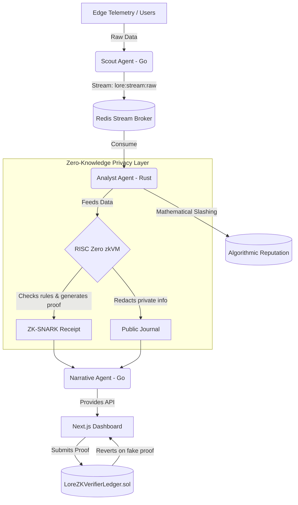

# Lore: Decentralized Behavioral Intelligence


Welcome to the Lore monorepo! Lore is a distributed edge architecture for autonomous behavioral data processing. It introduces a paradigm shift in AI observability by forcing AI agents to mathematically prove their workflows using **Zero-Knowledge Proofs (ZKVM)** and enforcing honesty via an **Off-Chain Algorithmic Slashing** mechanic.

---

## 🏗️ Architecture Overview

The Lore system consists of tiered agentic layers interacting across a distributed message broker, validated cryptographically before being pushed to the blockchain.



---

## 🚀 Key Pillars

### 1. Zero-Knowledge Privacy Layer
Instead of exposing raw JSON payloads or proprietary enterprise data, Lore relies on **RISC Zero zkVM**. 
- The **Guest Circuit** executes inside the VM to securely verify that the agent didn't hallucinate.
- The **Verifier Contract** (`LoreZKVerifierLedger.sol`) strictly requires a valid cryptographic ZK-SNARK proof before it will permanently store the insights on the blockchain.

### 2. Algorithmic Trust & Slashing
Agents are held mathematically accountable without the need for expensive ERC20 staking tokens. 
- The system automatically assigns a **Trust Score** based on an agent's success rate: `(Success / (Success + Fail)) * 100`.
- If an agent hallucinates, they are hit with an **exponential penalty factor**.
- If an agent's score drops below **60%**, the system explicitly bans them from committing further data.

### 3. Agentic Observability & Resilience
Powered by OpenTelemetry and Jaeger, every single behavioral event is traceable from the edge ingestion point all the way to the final LLM summary. Built-in Dead-Letter Queues (DLQ) ensure that even during LLM provider outages, no insights are lost.

---

## 🛠️ System Components

- **Scout Agent (Go)**: Ingestion service at the edge acting as an MCP Client. Pushes data to Redis. Contains the `reputation.go` module for mathematical trust calculations.
- **Analyst Agent (Rust)**: Asynchronous stream processor. Consumes raw data, triggers the ZKVM for proof generation, and acts as the "Punisher" to slash hallucinating agents.
- **Narrative Agent (Go)**: The synthesis layer interfacing with Google Gemini (gemini-2.5-flash) to generate PM-friendly summaries. Exposes the REST API.
- **Dashboard (Next.js)**: The command center. Displays the Global Trust Leaderboard, blocks slashed agents, and provides the UI to commit ZK-Proofs to the blockchain.
- **ZK Circuit (Rust)**: The RISC Zero guest/host implementation.
- **Smart Contracts (Solidity)**: The blockchain enforcer verifying Groth16 proofs.

---

## 💻 Getting Started

### Prerequisites
- Docker & Docker Compose
- Go 1.25+
- Rust 1.70+ & RISC Zero Toolchain (`cargo binstall cargo-risczero`)
- Node.js 20+

### Orchestration Commands (Root `Makefile`)

1. **Start Infrastructure** (Redis, Jaeger):
   ```bash
   make up
   ```
2. **Initialize Redis Streams**:
   ```bash
   make init
   ```
3. **Start the Next.js Dashboard**:
   ```bash
   cd apps/dashboard && npm run dev
   ```

### Environment Setup
You will need `.env` files for the respective agents:
- `agents/scout-agent/.env` (Requires `NOVUS_MCP_ENDPOINT`)
- `agents/narrative-agent/.env` (Requires `GEMINI_API_KEY`)

---

*Lore: Built for a future where Autonomous Agents have skin in the game.*
